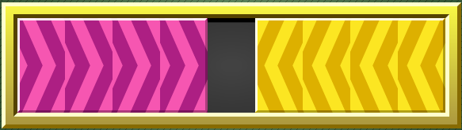

# Lucas problem

This program solves the lucas puzzle. This is part of an exercise from computational intelligence class.

Puzzle: 

```
This puzzle was invented in the late nineteenth century by Edouard Lucas, a French mathematician. The 
object is very simple. You are given a pattern, two sets of colored markers, with an empty space 
in the middle. You have to reverse the pattern. Just to keep it interesting, there are a few rules 
on how you can go about this. The markers can only be moved in one direction, red markers toward the 
right, and blue markers toward the left. Second, a marker can only be moved to the empty space by 
either sliding it over to the adjacent square, or by jumping over one other marker.
```
<p align="center">
	<a href="">
		
	</a>
</p>

## How to run

```
$ npm i
$ npm run build
```

## Example 

Inicial State:

```javascript
const initialState = '>>>> <<<<'
```

Final State:

```javascript
const objectiveState = '<<<< >>>>'
```

Output: 

```
Lucas puzzle
>>>> <<<< -> <<<< >>>>
[ '>>>> <<<<',
  '>>> ><<<<',
  '>>><> <<<',
  '>>><>< <<',
  '>>>< <><<',
  '>> <><><<',
  '> ><><><<',
  '><> ><><<',
  '><><> ><<',
  '><><><> <',
  '><><><>< ',
  '><><>< <>',
  '><>< <><>',
  '>< <><><>',
  ' <><><><>',
  '< ><><><>',
  '<<> ><><>',
  '<<><> ><>',
  '<<><><> >',
  '<<><>< >>',
  '<<>< <>>>',
  '<< <><>>>',
  '<<< ><>>>',
  '<<<<> >>>',
  '<<<< >>>>' ]
```
